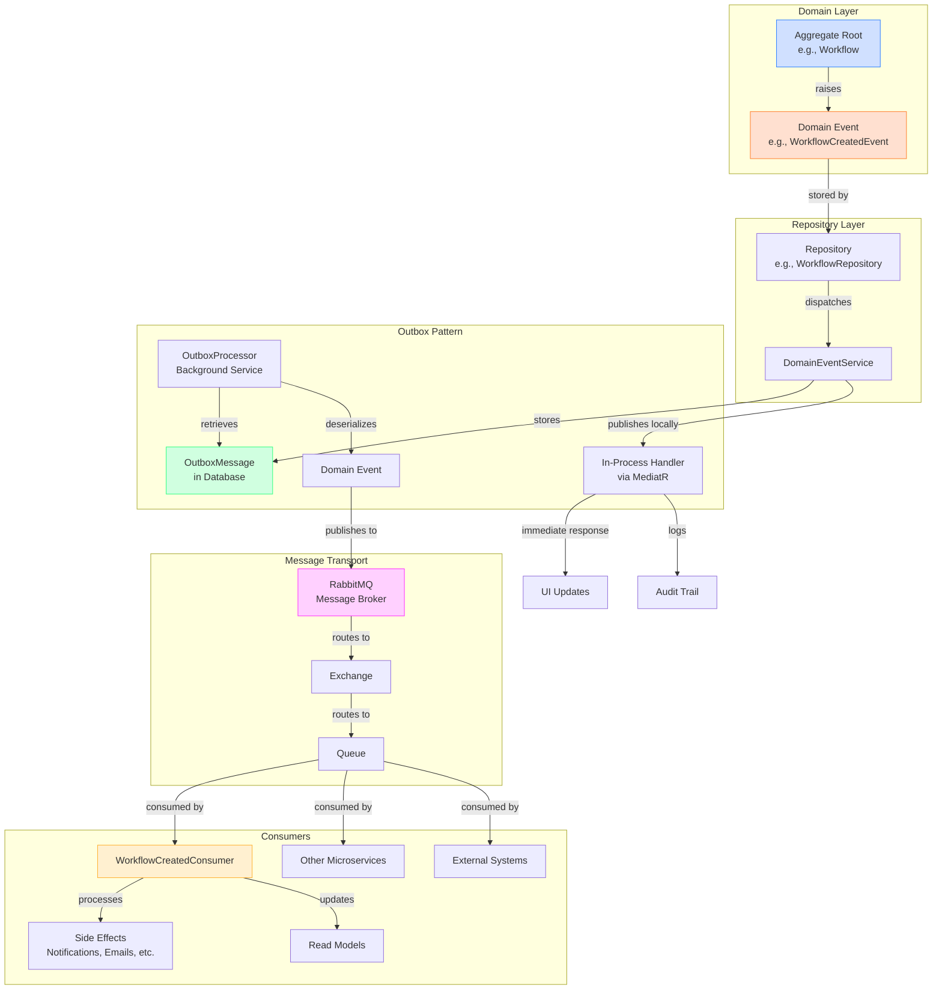

```mermaid
graph TD
    subgraph "Domain Layer"
        A[Aggregate Root\ne.g., Workflow] -->|raises| B[Domain Event\ne.g., WorkflowCreatedEvent]
    end
    
    subgraph "Repository Layer"
        B -->|stored by| C[Repository\ne.g., WorkflowRepository]
        C -->|dispatches| D[DomainEventService]
    end
    
    subgraph "Outbox Pattern"
        D -->|stores| E[OutboxMessage\nin Database]
        D -->|publishes locally| F[In-Process Handler\nvia MediatR]
        
        G[OutboxProcessor\nBackground Service] -->|retrieves| E
        G -->|deserializes| H[Domain Event]
    end
    
    subgraph "Message Transport"
        H -->|publishes to| I[RabbitMQ\nMessage Broker]
        I -->|routes to| J[Exchange]
        J -->|routes to| K[Queue]
    end
    
    subgraph "Consumers"
        K -->|consumed by| L[WorkflowCreatedConsumer]
        K -->|consumed by| M[Other Microservices]
        K -->|consumed by| N[External Systems]
        
        L -->|processes| O[Side Effects\nNotifications, Emails, etc.]
        L -->|updates| P[Read Models]
    end
    
    F -->|immediate response| Q[UI Updates]
    F -->|logs| R[Audit Trail]
    
    style A fill:#d0e0ff,stroke:#3080ff
    style B fill:#ffe0d0,stroke:#ff8030
    style E fill:#d0ffe0,stroke:#30ff80
    style I fill:#ffd0ff,stroke:#ff30ff
    style L fill:#fff0d0,stroke:#ffb030
```