# ZenFlow Event-Driven Architecture with Workflow Module

This document provides a visualization and explanation of the event-driven pipeline in the ZenFlow application, focusing specifically on the Workflow module.

## Event Flow Diagram

```mermaid
flowchart TD
    subgraph "Domain Layer (Aggregate Roots)"
        WF[Workflow Aggregate]
        WN[WorkflowNode Entity]
        WE[WorkflowEdge Entity]
        WX[WorkflowExecution Aggregate]
        NE[NodeExecution Entity]
    end
    
    subgraph "Domain Events"
        WF -->|raises| WFC[WorkflowCreatedEvent]
        WF -->|raises| WFU[WorkflowUpdatedEvent]
        WF -->|raises| WFA[WorkflowActivatedEvent]
        WF -->|raises| WFAR[WorkflowArchivedEvent]
        WF -->|raises| WFR[WorkflowRestoredEvent]
        
        WF -->|raises| WNC[WorkflowNodeCreatedEvent]
        WF -->|raises| WNU[WorkflowNodeUpdatedEvent]
        WF -->|raises| WND[WorkflowNodeDeletedEvent]
        
        WF -->|raises| WEC[WorkflowEdgeCreatedEvent]
        WF -->|raises| WEU[WorkflowEdgeUpdatedEvent]
        WF -->|raises| WED[WorkflowEdgeDeletedEvent]
        
        WX -->|raises| WXC[WorkflowExecutionCreatedEvent]
        WX -->|raises| WXS[WorkflowExecutionStartedEvent]
        WX -->|raises| WXCM[WorkflowExecutionCompletedEvent]
        WX -->|raises| WXF[WorkflowExecutionFailedEvent]
        WX -->|raises| WXCN[WorkflowExecutionCancelledEvent]
        
        WX -->|raises| NEC[NodeExecutionCreatedEvent]
        WX -->|raises| NES[NodeExecutionStartedEvent]
        WX -->|raises| NECM[NodeExecutionCompletedEvent]
        WX -->|raises| NEF[NodeExecutionFailedEvent]
        WX -->|raises| NESK[NodeExecutionSkippedEvent]
    end
    
    subgraph "Repository Layer"
        WFC & WFU & WFA & WFAR & WFR & WNC & WNU & WND & WEC & WEU & WED -->|collected by| WFR2[WorkflowRepository]
        WXC & WXS & WXCM & WXF & WXCN & NEC & NES & NECM & NEF & NESK -->|collected by| WXR[WorkflowExecutionRepository]
        
        WFR2 & WXR -->|dispatches| DES[DomainEventService]
    end
    
    subgraph "Outbox Pattern"
        DES -->|stores in DB| OM[OutboxMessage]
        DES -->|publishes in-process| MH[MediatR Handlers]
        
        OP[OutboxProcessor] -.->|polls| OM
        OP -->|deserializes| DE[Domain Event Object]
        
        MH -->|immediate handling| IL1[Logging]
        MH -->|immediate handling| IL2[API Response]
        MH -->|immediate handling| IL3[UI Notifications]
    end
    
    subgraph "Message Transport (RabbitMQ)"
        DE -->|publishes to| RMQ[RabbitMQ]
        
        RMQ -->|routes to| WFE[Workflow Events Exchange]
        RMQ -->|routes to| WXE[Workflow Execution Exchange]
        
        WFE -->|routes to| WFQ[Workflow Events Queue]
        WXE -->|routes to| WXQ[Workflow Execution Queue]
    end
    
    subgraph "Consumers (MassTransit)"
        WFQ -->|consumed by| WFC2[WorkflowCreatedConsumer]
        WFQ -->|consumed by| WNC2[WorkflowNodeConsumers]
        WFQ -->|consumed by| WEC2[WorkflowEdgeConsumers]
        
        WXQ -->|consumed by| WXC2[WorkflowExecutionConsumers]
        WXQ -->|consumed by| NEC2[NodeExecutionConsumers]
    end
    
    subgraph "Side Effects & Read Models"
        WFC2 -->|triggers| NS[Notification Service]
        WXC2 -->|updates| DS[Dashboard Service]
        WFC2 & WNC2 & WEC2 -->|updates| WRM[Workflow Read Model]
        WXC2 & NEC2 -->|updates| ERM[Execution Read Model]
        
        NS -->|sends| NF[Email Notifications]
        DS -->|updates| DV[Dashboard Visualization]
    end
    
    style WF fill:#d0e0ff,stroke:#3080ff,stroke-width:2px
    style WX fill:#d0e0ff,stroke:#3080ff,stroke-width:2px
    style WFC fill:#ffe0d0,stroke:#ff8030,stroke-width:2px
    style WXC fill:#ffe0d0,stroke:#ff8030,stroke-width:2px
    style OM fill:#d0ffe0,stroke:#30ff80,stroke-width:2px
    style RMQ fill:#ffd0ff,stroke:#ff30ff,stroke-width:2px
    style WFC2 fill:#fff0d0,stroke:#ffb030,stroke-width:2px
    style WRM fill:#e0e0ff,stroke:#8080ff,stroke-width:2px
    style ERM fill:#e0e0ff,stroke:#8080ff,stroke-width:2px
```



## Event Types in the Workflow Module

### Workflow Aggregate Events
- **WorkflowCreatedEvent**: Raised when a new workflow is created
- **WorkflowUpdatedEvent**: Raised when a workflow's properties are updated
- **WorkflowActivatedEvent**: Raised when a workflow transitions from DRAFT to ACTIVE status
- **WorkflowArchivedEvent**: Raised when a workflow is archived
- **WorkflowRestoredEvent**: Raised when an archived workflow is restored

### Workflow Node Events
- **WorkflowNodeCreatedEvent**: Raised when a node is added to a workflow
- **WorkflowNodeUpdatedEvent**: Raised when a node's properties are updated
- **WorkflowNodeDeletedEvent**: Raised when a node is removed from a workflow

### Workflow Edge Events
- **WorkflowEdgeCreatedEvent**: Raised when an edge is added between nodes
- **WorkflowEdgeUpdatedEvent**: Raised when an edge's properties are updated
- **WorkflowEdgeDeletedEvent**: Raised when an edge is removed from a workflow

### Workflow Execution Events
- **WorkflowExecutionCreatedEvent**: Raised when a workflow execution is created
- **WorkflowExecutionStartedEvent**: Raised when a workflow execution starts running
- **WorkflowExecutionCompletedEvent**: Raised when a workflow execution completes successfully
- **WorkflowExecutionFailedEvent**: Raised when a workflow execution fails
- **WorkflowExecutionCancelledEvent**: Raised when a workflow execution is cancelled

### Node Execution Events
- **NodeExecutionCreatedEvent**: Raised when a node execution is created
- **NodeExecutionStartedEvent**: Raised when a node execution starts running
- **NodeExecutionCompletedEvent**: Raised when a node execution completes successfully
- **NodeExecutionFailedEvent**: Raised when a node execution fails
- **NodeExecutionSkippedEvent**: Raised when a node execution is skipped

## Outbox Pattern Implementation

The ZenFlow application implements the outbox pattern to ensure reliable delivery of domain events:

1. **Event Storage**: When a domain event is raised, it is stored in the `OutboxMessages` table in the database as part of the same transaction that modifies the domain entities.

2. **In-Process Handling**: Events are immediately published to in-process handlers via MediatR for immediate effects (like logging, API responses).

3. **Background Processing**: A background service (`OutboxProcessor`) periodically polls the outbox table for unprocessed messages, publishes them to RabbitMQ, and marks them as processed.

4. **Cleanup**: Another background service (`OutboxCleaner`) periodically removes old processed messages from the outbox table.

## Benefits of This Architecture

- **Reliability**: Even if RabbitMQ is temporarily unavailable, events are not lost. They remain in the outbox until successfully processed.
  
- **Consistency**: Events are stored as part of the same transaction that modifies the domain entities, ensuring that if the transaction succeeds, the events will eventually be processed.

- **Scalability**: Event consumers can be scaled independently of event producers, allowing for horizontal scaling.

- **Decoupling**: Publishers and consumers don't need to know about each other, promoting loose coupling and flexibility.

- **Isolated Processing**: Long-running event processing tasks don't block the API response.

## Consumer Implementation

Consumers are implemented using MassTransit and are responsible for handling events from RabbitMQ. For example:

```csharp
public class WorkflowCreatedConsumer : IConsumer<WorkflowCreatedEvent>
{
    private readonly ILogger<WorkflowCreatedConsumer> _logger;

    public WorkflowCreatedConsumer(ILogger<WorkflowCreatedConsumer> logger)
    {
        _logger = logger;
    }

    public Task Consume(ConsumeContext<WorkflowCreatedEvent> context)
    {
        var @event = context.Message;
        
        _logger.LogInformation(
            "Consumed WorkflowCreatedEvent from RabbitMQ: Workflow {WorkflowId} with name '{Name}' was created at {OccurredOn}",
            @event.WorkflowId,
            @event.Name,
            @event.OccurredOn);
        
        // Handle the event - update read models, send notifications, etc.
        return Task.CompletedTask;
    }
}
```